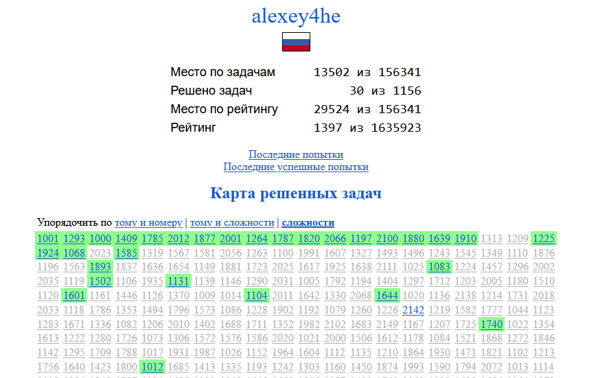

# Навигация:

## Лабороторные работы 1 курс:
1) [Лабораторная работа №1](https://github.com/StupidFraid/javaBasicLab/tree/master/src/Lab_1) :white_check_mark:
2) [Лабораторная работа №2](https://github.com/StupidFraid/javaBasicLab/tree/master/src/Lab_2) :white_check_mark:
3) [Лабораторная работа №3](https://github.com/StupidFraid/javaBasicLab/tree/master/src/Lab_3) :white_check_mark:
4) [Лабораторная работа №4](https://github.com/StupidFraid/javaBasicLab/tree/master/src/Lab_4) :white_check_mark:
5) [Лабораторная работа №5](https://github.com/StupidFraid/javaBasicLab/tree/master/src/Lab_5) :white_check_mark:
6) [Лабораторная работа №6](https://github.com/StupidFraid/javaBasicLab/tree/master/src/Lab_6) :white_check_mark:
7) [Лабораторная работа №7](https://github.com/StupidFraid/javaBasicLab/tree/master/src/Lab_7) :white_check_mark:
8) [Лабораторная работа №8](https://github.com/StupidFraid/javaBasicLab/tree/master/src/Lab_8) :white_check_mark:
9) [Лабораторная работа №9](https://github.com/StupidFraid/javaBasicLab/tree/master/src/Lab_9) :white_check_mark:
10) [Лабораторная работа №10](https://github.com/StupidFraid/javaBasicLab/tree/master/src/Lab_10) :white_check_mark:
11) [Лабораторная работа №11](https://github.com/StupidFraid/javaBasicLab/tree/master/src/Lab_11) :white_check_mark:
12) [Лабораторная работа №12](https://github.com/StupidFraid/javaBasicLab/tree/master/src/Lab_12) :white_check_mark:
13) [Лабораторная работа №13](https://github.com/StupidFraid/javaBasicLab/tree/master/src/Lab_13) :white_check_mark:

### Timus: [Задачи на Timus](https://github.com/StupidFraid/javaBasicLab/tree/master/src/timus)
Проверить список всех решенных задач можно [здесь](https://acm.timus.ru/author.aspx?id=350825)
